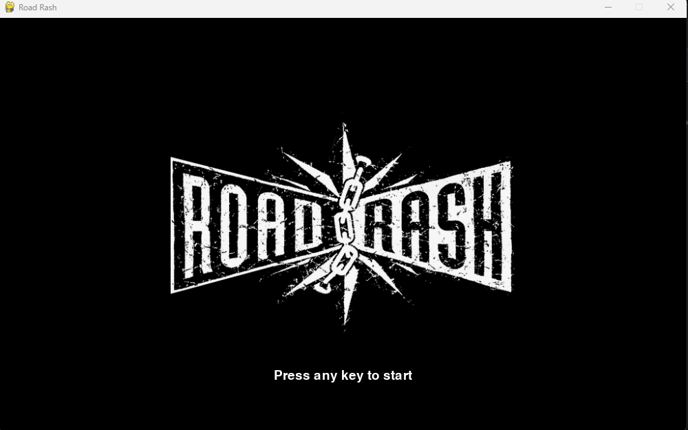
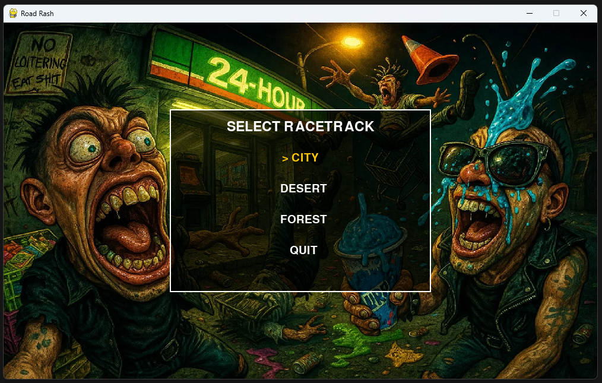
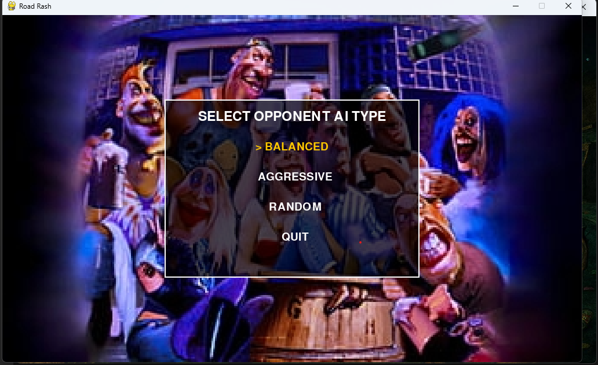
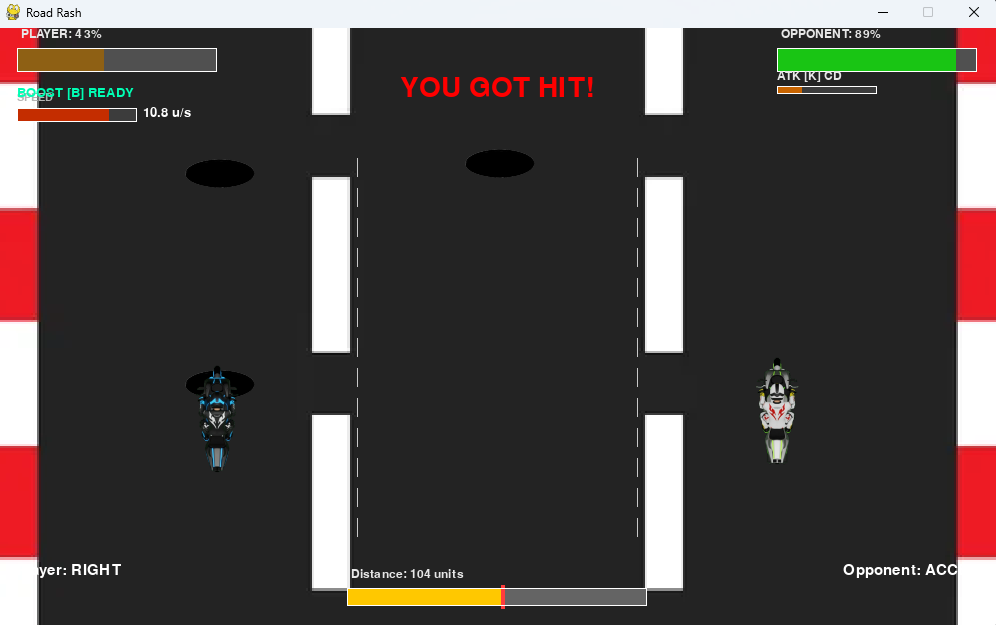
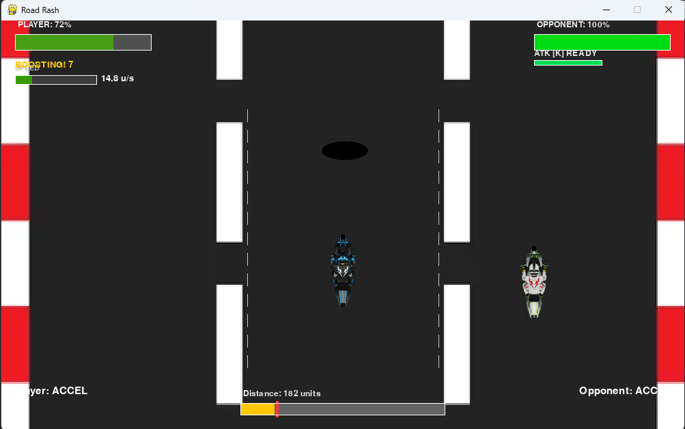
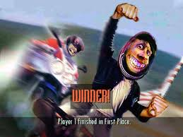
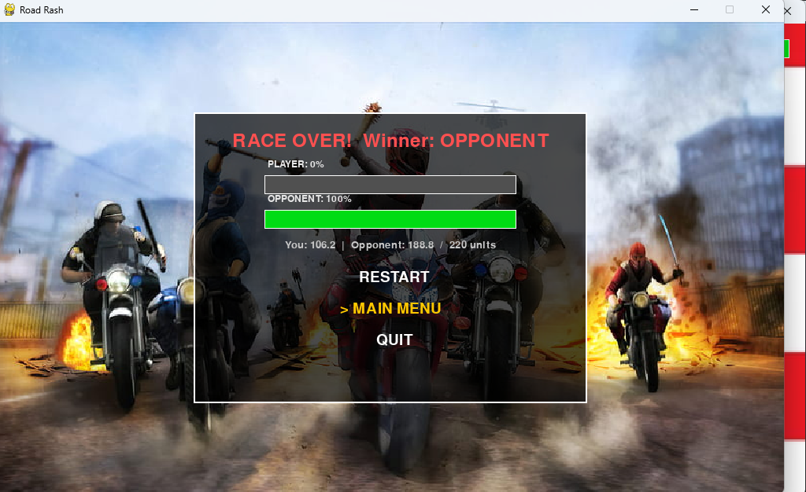

# Road Rash — Pygame Edition

> A 2D pseudo-3D arcade racing combat game built in Python using Pygame, inspired by the classic 1991 Road Rash series. Race against an AI opponent on one of three tracks, attack rivals, dodge hazards, and reach the finish line first.

---

## Screenshots

> Add your screenshots to a `screenshots/` folder in the project root.
> Recommended resolution: **1000×600** (matches the game window).

### Menus

| | | |
|:---:|:---:|:---:|
|  |  |  |
| *Splash Screen* | *Track Select* | *AI Difficulty Select* |

### Race

| | |
|:---:|:---:|
|  |  |
| *City Track* | *Desert Track* |

| | |
|:---:|:---:|
|  |  |
| *Combat — Attacking Opponent* | *Hazard — Oil Slick* |

### Results

| | |
|:---:|:---:|
|  |  |
| *Victory Screen* | *Defeat Screen* |

| |
|:---:|
|  |
| *Results — Final Stats* |

---

## Core Idea

This is the original Python/Pygame prototype that preceded the Godot 4 version. It implements the core Road Rash gameplay loop — a pseudo-3D perspective racing game where the player races a motorcycle against an AI opponent, can attack them directly, and must avoid road hazards. The AI uses a **minimax algorithm with alpha-beta pruning** to choose its actions each tick, making it a genuinely competitive opponent.

The game runs at a fixed tick rate of 0.14 seconds and renders at 60 FPS, decoupling game logic from rendering.

---

## Requirements

- **Python 3.8+**
- **Pygame 2.x**

Install dependencies:

```bash
pip install pygame
```

> **Note:** Pygame 2.6.x does not support Python 3.14. Use Python 3.12 for best compatibility.
>
> ```bash
> py -3.12 -m pip install pygame
> py -3.12 roadrashfinal.py
> ```

---

## Running the Game

```bash
python roadrashfinal.py
```

Or with a specific Python version:

```bash
py -3.12 roadrashfinal.py
```

The game window opens at **1000×600** resolution.

---

## Controls

| Key | Action |
|---|---|
| W | Accelerate |
| S | Brake |
| A | Move to left lane |
| D | Move to right lane |
| K | Attack |
| B | Boost (one-time per race) |
| ESC | Pause |
| ↑ / ↓ (menus) | Navigate options |
| Enter | Confirm selection |

---

## Game Flow

```
Splash Screen (logo slide-in)
    └── Track Select (City / Desert / Forest)
            └── AI Select (Balanced / Aggressive / Random)
                    └── Race
                            └── Results
                                    ├── Restart
                                    ├── Main Menu
                                    └── Quit
```

---

## Gameplay Features

### Racing
- **3 lanes** — player moves between lanes using A/D keys
- **Track length** — 220 units per race
- **Speed system** — acceleration, braking, and natural deceleration
- **Boost** — one-time speed multiplier (5x) lasting 2 seconds, triggered with B

### Combat
- **Attack (K)** — punch the opponent or neutral riders if in the same lane and within 3.5 units
- **Attack cooldown** — 1.8 seconds between attacks
- **Damage** — 0.28 HP per hit (max HP = 1.0)
- **Win by KO** — reduce opponent HP to 0 to win instantly

### Hazards
- **8 hazards** per race — oil slicks and potholes placed randomly on the track
- **Slip effect** — hitting a hazard reduces speed by 45% and deals 0.05 HP damage
- **Both riders** affected — AI can also hit hazards

### Neutral Riders
- **3 neutral bikes** on the track — they move at random speeds and change lanes
- **Can be attacked** — if the opponent is not in range, attacking hits a neutral rider instead

### AI System
- **Minimax with alpha-beta pruning** — the AI evaluates future game states to choose the best action
- **3 difficulty modes:**
  - **Balanced** — depth 1 minimax (one move lookahead)
  - **Aggressive** — depth 2 minimax (two move lookahead)
  - **Random** — picks a random action each tick
- **6 possible actions** evaluated: ACCEL, BRAKE, LEFT, RIGHT, ATTACK, MAINTAIN
- **Evaluation function** — scores states by `(ai_pos - player_pos) + (ai_health - player_health) * 5`

---

## Visual Features

### Pseudo-3D Rendering
- Sprites are drawn at screen positions calculated from world coordinates using a viewport projection formula
- Objects further away appear higher on screen and smaller (perspective illusion)
- Player bike is always drawn at the bottom centre of the track area

### HUD
- **Health bars** — top-left (player) and top-right (opponent), colour shifts green→red as HP drops
- **Distance bar** — bottom centre, shows both player (yellow) and opponent (red tick) progress
- **Speedometer** — colour bar showing current speed relative to max
- **Boost widget** — shows READY (green), BOOSTING (yellow), or USED (grey)
- **Attack cooldown bar** — shows recharge progress, green when ready
- **Flash messages** — centre screen alerts for HIT, MISSED, SLIPPED, BOOST ACTIVATED
- **Controls overlay** — shown on first launch, disappears on first input

### Menus
- **Neon grid background** — animated perspective grid on all menu screens
- **CRT scanline overlay** — scanlines + vignette effect
- **Animated splash** — logo slides down from top with fade-in on black background
- **Arrow selection** — `>` prefix on selected menu item

### Tracks
Each track has its own background image:
- `city_track.png` — urban environment
- `desert_track.png` — desert landscape
- `forest_track.png` — forest road

---

## Project Structure

```
roadrashfinal.py        # Single-file game — all logic, rendering, and UI
assets/
├── player_bike.png     # Player sprite
├── opponent_bike.png   # Opponent sprite
├── neutral_bike.png    # Neutral rider sprite
├── hazard_oil.png      # Oil slick hazard
├── hazard_pothole.png  # Pothole hazard
├── city_track.png      # City track background
├── desert_track.png    # Desert track background
├── forest_track.png    # Forest track background
├── track_select_bg.png # Track selection menu background
├── ai_background.png   # AI selection menu background
├── roadrash_logo.png   # Splash screen logo
├── results_bg.png      # Results screen background
├── winner.png          # Win screen image
└── loser.PNG           # Lose screen image
```

---

## Architecture

The entire game is contained in a single Python file (`roadrashfinal.py`). Key components:

### State Management
- `State` — dataclass holding all game state: positions, speeds, lanes, health, hazards, neutrals, timers
- `State.copy()` — deep copies state for minimax simulation without mutating the real game
- Fixed tick rate (`TICK = 0.14s`) — game logic runs at this rate regardless of frame rate

### Core Functions

| Function | Purpose |
|---|---|
| `simulate_one_tick(state, pa, oa)` | Advances game state by one tick given player and opponent actions |
| `minimax(state, depth, maximizing, α, β)` | Alpha-beta minimax for AI action selection |
| `opponent_choose_action(state, type)` | Selects AI action based on difficulty mode |
| `evaluate_state(state)` | Scores a game state for minimax |
| `world_to_screen(pos, player_pos, lane)` | Projects world coordinates to screen coordinates |
| `draw_health_bar(surf, x, y, w, h, pct)` | Renders a colour-shifting health bar |
| `draw_distance_bar(surf, ...)` | Renders the dual-rider progress bar |

### Scene Functions

| Function | Purpose |
|---|---|
| `show_intro(screen, font)` | Animated splash screen |
| `select_racetrack(screen, font)` | Track selection menu |
| `select_opponent_type(screen, font)` | AI difficulty menu |
| `run_game(opponent_type, track)` | Main game loop |
| `show_results(screen, font, state)` | Post-race results screen |

### Font Caching
All `pygame.font.SysFont()` calls go through `get_font(size)` which caches font objects — prevents per-frame font creation which caused micro-stutters in earlier versions.

### Scene Manager
`SceneManager` autoload handles all transitions with a black fade. `force_unlock()` prevents stuck transitions if a scene errors during load.

---

## Constants Reference

| Constant | Value | Description |
|---|---|---|
| `LANES` | 3 | Number of lanes |
| `TRACK_LENGTH` | 220.0 | Race distance in world units |
| `TICK` | 0.14s | Game logic tick interval |
| `MAX_SPEED` | 14.0 | Maximum normal speed |
| `BOOST_SPEED_MULT` | 5.0 | Speed multiplier during boost |
| `ATTACK_RANGE` | 3.5 | Attack hit range in world units |
| `ATTACK_DAMAGE` | 0.28 | HP damage per hit |
| `ATTACK_COOLDOWN_TICKS` | ~13 ticks | Cooldown between attacks |
| `HAZARD_COUNT` | 8 | Hazards per race |
| `NEUTRAL_COUNT` | 3 | Neutral riders per race |
| `SCREEN_W / SCREEN_H` | 1000 × 600 | Window resolution |

---

## Known Issues & Limitations

- **Python 3.14 incompatible** — Pygame 2.6.x build system fails on Python 3.14. Use Python 3.12.
- **Windows-only beep** — `try_beep()` uses `winsound` which silently fails on non-Windows platforms
- **Single opponent** — only one AI opponent per race (the Godot version has 3)
- **No curved road** — track is a straight pseudo-3D projection
- **No save system** — best times are not persisted between sessions

---

## Differences from the Godot Version

| Feature | Pygame Version | Godot Version |
|---|---|---|
| Rendering | 2D pseudo-3D | Full 3D |
| Opponents | 1 AI | 3 AI opponents |
| Road | Straight | Straight (curved in development) |
| Boost pads | None | 4 collectible capsules on track |
| Lap system | No (single run) | 3 laps |
| Save system | No | Best time per track (JSON) |
| Audio | None | Full music + SFX |
| Platform | Python + Pygame | Godot 4 (standalone) |

---

## License

This project is for educational and portfolio purposes.
